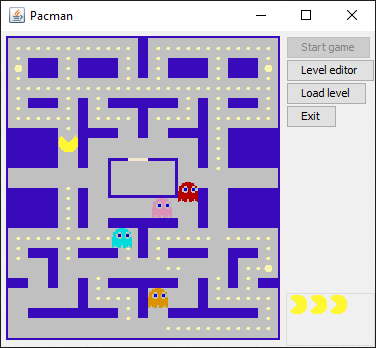

# Pacman

Pacman game in Java. 
The game was written by me back in 2009 when I was studying in University. 
It uses pathfinding Lee algorithm to find the closest path from ghost(enemy) to pacman(player). 

**There are two main parts:**  
_Level Editor_ that looks like this:

 and 
_Pacman game_ itself:

Classic is the first level. 
To start the game press 'Load Level' button, then choose Classic and click 'Start game'.

**Controls:** 
Arrows  &nbsp; ↑, ←, ↓, → &nbsp;&nbsp; or &nbsp; w,a,s,d
